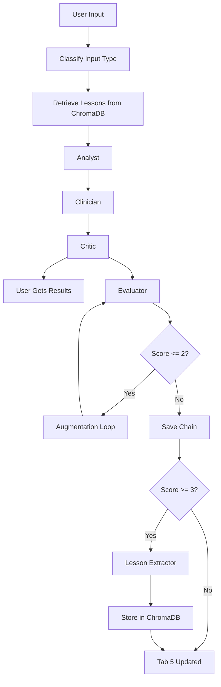

# MedConsult Architecture — File-by-File Guide

## Overview

MedConsult is a **multi-agent medical analysis system** with **SiriuS self-improvement**. Three MedGemma agents (Analyst → Clinician → Critic) process medical data; a cloud Evaluator scores quality; and lessons are extracted and stored for future runs.

---

## Simple Orchestration Flowchart

```
┌─────────────────────────────────────────────────────────────────────────────┐
│                         USER SUBMITS MEDICAL INPUT                           │
│                    (text + optional image via Gradio)                         │
└─────────────────────────────────────┬───────────────────────────────────────┘
                                      │
                                      ▼
┌─────────────────────────────────────────────────────────────────────────────┐
│  STEP 1: MEMORY RETRIEVAL                                                    │
│  • experience_library.classify_input_type(text)  → lab_report | clinical_note│
│  • memory_retriever.get_context_for_agent()      → fetch lessons from        │
│    ChromaDB for analyst, clinician, critic                                   │
│  • If lessons exist → inject as "memory_context" into each agent prompt      │
└─────────────────────────────────────┬───────────────────────────────────────┘
                                      │
                                      ▼
┌─────────────────────────────────────────────────────────────────────────────┐
│  STEP 2: AGENT CHAIN (MedGemma — runs in sequence)                           │
│                                                                              │
│    Analyst.analyze(input, memory_context)                                    │
│         │   → Extracts facts, flags out-of-range values                      │
│         ▼                                                                   │
│    Clinician.interpret(input, analyst_out, memory_context)                   │
│         │   → Interprets patterns, differentials, urgency                    │
│         ▼                                                                   │
│    Critic.review_and_communicate(input, analyst_out, clinician_out, mem)     │
│         │   → Critical review + patient-friendly summary                     │
│         ▼                                                                   │
│    ★ USER GETS RESULTS (Patient Summary, Analyst, Clinician tabs)            │
└─────────────────────────────────────┬───────────────────────────────────────┘
                                      │
                                      ▼
┌─────────────────────────────────────────────────────────────────────────────┐
│  STEP 3: SIRIUS (runs ASYNC in background — never blocks user)               │
│                                                                              │
│  A. Evaluator.evaluate(input, analyst, clinician, critic)                    │
│     → Gemini scores 1–5, returns issues + improvements                       │
│                                                                              │
│  B. If score ≤ 2 → AugmentationLoop.augment()                                │
│     → Re-run Analyst→Clinician→Critic with feedback in prompts               │
│     → Accept if score improves to ≥ 4                                        │
│                                                                              │
│  C. experience_library.save_chain() → store raw JSON in good/ or bad/        │
│                                                                              │
│  D. If score ≥ 3 → LessonExtractor.extract(chain)                            │
│     → Gemini distills 2–5 reasoning lessons from chain                       │
│     → memory_store.store_lessons() → ChromaDB vector store                   │
│                                                                              │
│  E. Tab 5 "SiriuS Intelligence" populated with score, lessons, badge         │
└─────────────────────────────────────────────────────────────────────────────┘
```

---

## File-by-File Explanation

### Entry Points

| File | Purpose |
|------|---------|
| **app.py** | Gradio web UI. Text input + image upload → runs pipeline → displays 5 tabs (Patient Summary, Analyst, Clinician, Processing Info, SiriuS). SiriuS runs in background; user gets results immediately. |
| **verify_setup.py** | Checks Python, deps, GPU, API keys. Optional quick inference test. |
| **prepopulate_memory.py** | Runs pipeline on CBC, clinical note, glucose inputs to build 10+ lessons in ChromaDB before demo. |

---

### Pipeline (Core Orchestration)

| File | Purpose |
|------|---------|
| **pipeline.py** | **MedConsultPipeline** — the main orchestrator. Wires MedGemma + Cloud + SiriuS. `run()` and `run_with_timing()` run Analyst→Clinician→Critic with memory injection. `evaluate_and_learn()` runs Evaluator → Augmentation (if low score) → Save chain → Extract lessons → Store in ChromaDB. |

---

### Agents (MedGemma — Clinical Tasks)

| File | Purpose |
|------|---------|
| **agents/analyst.py** | **AnalystAgent** — extracts facts only (no interpretation). Uses MedGemma + ANALYST_SYSTEM_PROMPT. Accepts `memory_context` (learned lessons) and `feedback` (from Evaluator for augmentation). |
| **agents/clinician.py** | **ClinicianAgent** — interprets patterns, differentials, urgency. Gets Analyst output + original input. Uses CLINICIAN_SYSTEM_PROMPT. |
| **agents/critic.py** | **CriticAgent** — reviews clinician output and writes plain-language patient summary. Uses CRITIC_SYSTEM_PROMPT. |
| **agents/evaluator.py** | **EvaluatorAgent** — uses **Gemini** (cloud). Scores Analyst+Clinician+Critic chain 1–5. Parses issues and improvements from response. |

---

### Prompts (System Instructions)

| File | Purpose |
|------|---------|
| **prompts/analyst_prompt.py** | ANALYST_SYSTEM_PROMPT — "Extract only, no interpretation; flag out-of-range; NOT PROVIDED if missing." |
| **prompts/clinician_prompt.py** | CLINICIAN_SYSTEM_PROMPT — "Interpret patterns, cite values, urgency level." |
| **prompts/critic_prompt.py** | CRITIC_SYSTEM_PROMPT — "Review clinician; write patient summary; jargon in parentheses." |
| **prompts/evaluator_prompt.py** | EVALUATOR_SYSTEM_PROMPT — "Score 1–5; check for hallucinations; issues and improvements." |

---

### Model Managers (Inference)

| File | Purpose |
|------|---------|
| **model/medgemma_manager.py** | **MedGemmaManager** — loads google/medgemma-1.5-4b-it (Hugging Face). Singleton. Handles text + image. GPU if available. |
| **model/cloud_manager.py** | **CloudManager** — Gemini (or OpenAI fallback). Used by Evaluator and LessonExtractor. Singleton. |
| **model/model_manager.py** | Alternative/local model manager (used in some tests). |

---

### SiriuS (Self-Improvement Layer)

| File | Purpose |
|------|---------|
| **sirius/memory_store.py** | **MemoryStore** — ChromaDB persistent vector store. `store_lessons()` adds lessons; `retrieve_lessons()` fetches by query + optional input_type. Uses all-MiniLM-L6-v2 embedding. |
| **sirius/memory_retriever.py** | **MemoryRetriever** — calls MemoryStore.retrieve_lessons() and formats as "LEARNED MEDICAL KNOWLEDGE" context for Analyst, Clinician, Critic prompts. |
| **sirius/lesson_extractor.py** | **LessonExtractor** — uses **Gemini**. Sends full chain to cloud; parses `<lesson>...</lesson>` blocks into structured lesson dicts (topic, rule, example_values, etc.). |
| **sirius/augmentation.py** | **AugmentationLoop** — when score ≤ 2, re-runs Analyst→Clinician→Critic with Evaluator feedback (issues + improvements) injected. Up to max_retries. |
| **sirius/experience_library.py** | **ExperienceLibrary** — saves raw chains as JSON in good/ (score ≥ 3) or bad/. `classify_input_type()` labels input as lab_report, clinical_note, imaging, or general. Stats in stats.json. |
| **sirius/orchestrator.py** | Optional orchestrator (simplified SiriuS flow; main logic lives in pipeline.evaluate_and_learn). |

---

### Utilities and Tests

| File | Purpose |
|------|---------|
| **download_model.py** | Downloads MedGemma model. |
| **run_test.py**, **run_tests_manual*.py** | Test runners. |
| **tests/test_phase*.py** | Phase 0–6 tests (setup, agents, pipeline, app). |
| **tests/test_data/** | sample_cbc.txt, sample_clinical_note.txt — sample inputs. |
| **results/** | Saved example outputs (placeholders). |

---

## Data Flow Summary

1. **Input** → ExperienceLibrary.classify_input_type  
2. **Memory** → MemoryRetriever.get_context_for_agent(analyst|clinician|critic)  
3. **Chain** → Analyst → Clinician → Critic (each gets memory_context if lessons exist)  
4. **User** → Gets Patient Summary (Critic output) immediately  
5. **SiriuS** → Evaluator → (Augmentation if score ≤ 2) → Save chain → LessonExtractor → MemoryStore  
6. **Next run** → Lessons from step 5 are retrieved and injected in step 2  

---

## Mermaid Flowchart (Alternative)


